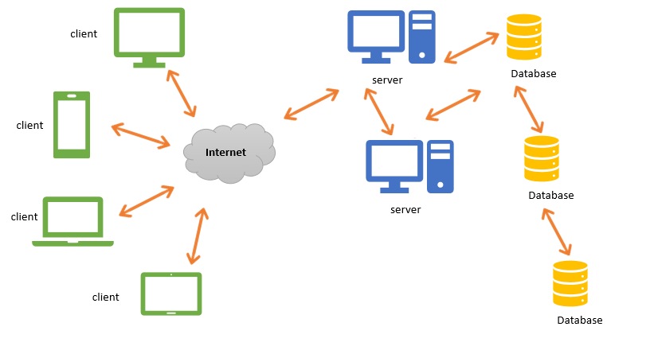

# chat-app-react
Project proposed by the University of Beira Interior on Distributed Systems.

### Main objectives:
- creation of a Web service
- creating a proxy for the Web service
- creation of a client (s) and / or server (s) (consumer) for the Web service.

### The project should involve the following characteristics of distributed systems:
- Resource Sharing
- Heterogeneity
- Scalability
- Transparency
- Concurrency
- Fault Tolerance
- Safety

This part of the project will be the creation of a react client for the Web service.

### Diagram

### Implementation 
This project was developed in React creating a Web Service, one proxy called nginx and two servers, one for frontend, and one backend for business logic and data storage. This chat implements resourse sharing having one database,divided between multiple machines in a cluster working for all users that need new information. The frontend can be use on any device that supports a browser, like a smartphone or a desktop, keeping the heterogeneity of the chat. The scalability of our chat allows, no matter how many users simultaneously use the aplication, to keep running because our server and database can have diferent instances working at the same time and our data have redundancies. Our system hides from the users the processes and the resourses used, only showing  user's the interface keeping the system transparency. The nodojs have a loop event that allows simultaneous requests in parallel, giving the chat a competition feature. It also replicates the databases for the case one of them fails, other one takes its place, other feature is the backup of the database, various instances in the same backend allow the case of fail to other one use the data. At last, the safety is present in the communication between client, server and database, because this comminications are encrypted using https.

### Compile & Start 
- npm install or npm i
- npm start
- yarn run sass

### Team

| Name                  | GitHub                                            | Linkedin                                           |
| --------------------- | ------------------------------------------------- | ------------------------------------------------- |
|  **Alexandre Mendes** | [aemendes](https://github.com/aemendes)           | [aemendes](https://www.linkedin.com/in/alexandre-mendes-84011a161) |
|      **Luis Pais**    | [ranguna](https://github.com/ranguna)             | [ranguna](https://www.linkedin.com/in/luis-pais-922246162) |
|    **João Marques**   | [JoaoDBMarques](https://github.com/JoaoDBMarques) | [JoaoDBMarques](https://www.linkedin.com/in/joão-marques-08575b150)              |
| **Catarina Bernardo** | [AnaBernard0](https://github.com/AnaBernard0)     | [AnaBernard0](https://www.linkedin.com/in/catarina-bernardo-03471b160) |

